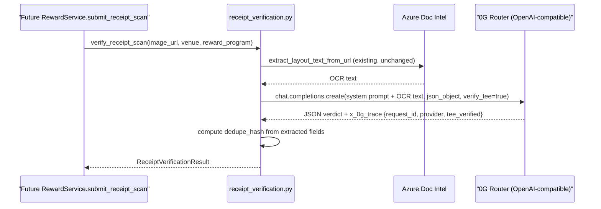

# 0G Router Integration for Receipt Verification

## Where this sits

This fills the "AI receipt-scanning pipeline" gap flagged as out-of-scope in both [venue_rewards_punch_card_system_5299d161.plan.md](.cursor/plans/venue_rewards_punch_card_system_5299d161.plan.md) and [hedera_hts_punch_card_nfts_c089456f.plan.md](/Users/matthew/.cursor/plans/hedera_hts_punch_card_nfts_c089456f.plan.md). Neither plan's tables exist in the codebase yet (confirmed: no `reward_program.py`/`punch_card.py`/`punch_event.py`/`hedera_*` files). This plan builds the 0G piece as a standalone, callable primitive — it does not build `RewardService` or the punch-card schema itself, matching how both referenced plans already scope those as separate follow-ups.



## Router vs Direct — Router, confirmed

Server-side call from `api_service`, so per 0G's own comparison table this is squarely a Router use case: single API key (`sk-...`), OpenAI-compatible `/v1/chat/completions`, no wallet/sub-account management. Base URLs:
- Mainnet: `https://router-api.0g.ai/v1`
- Testnet: `https://router-api-testnet.integratenetwork.work/v1` (use this first, consistent with the Hedera plan's testnet-first approach)

Since it's OpenAI-compatible, the existing `openai==1.68.2` dependency and `shared/utils/openai_retry.py` retry policy are reused as-is — no new package.

## TEE proof — surface it, don't independently re-verify

Passing `"verify_tee": true` makes the Router return a `x_0g_trace` block on every response:
```json
"x_0g_trace": {
  "request_id": "0852f405-...",
  "provider": "0xd9966e13...",
  "billing": {...},
  "tee_verified": true
}
```
Per your instruction, this plan just writes those three fields through (`request_id`, `provider`, `tee_verified`) — no independent on-chain re-verification (that would need the TS SDK / EIP-191 signature check, out of scope). These three values are exactly what would later go into `PunchEvent` and get included in the HCS message string in the Hedera plan's `submit_punch_hcs_message`, giving a tamper-proof pointer back to the attested AI decision.

## New files/changes

### 1. Config — [backend/shared/config.py](backend/shared/config.py)
Add next to the existing `AZURE_DOCUMENT_INTELLIGENCE_*` block:
```python
ZG_ROUTER_BASE_URL: Optional[str] = None   # e.g. https://router-api-testnet.integratenetwork.work/v1
ZG_ROUTER_API_KEY: Optional[str] = None    # sk-... from pc.0g.ai
ZG_ROUTER_MODEL: str = "zai-org/GLM-5-FP8"
ZG_VERIFY_TEE: bool = True
```
Add matching placeholder keys to `backend/.env.local` / `backend/.env.prod` (values left blank/TODO — actual secrets provisioned by you via pc.0g.ai, not generated by me).

### 2. New service — `backend/shared/services/receipt_verification.py`
Single file (no multi-stage pipeline directory — this is one OCR call + one LLM call, same shape as `extract_plain.py`'s Azure-Read-then-GPT path but simpler):

- `ReceiptVerificationResult` (pydantic `BaseModel`, colocated in this file — same convention as `ExtractedDeal` in [backend/shared/services/venue_scrape_job/models.py](backend/shared/services/venue_scrape_job/models.py)):
  - `is_valid: bool`, `venue_match: bool`
  - `receipt_date: Optional[datetime]`, `receipt_total_amount: Optional[Decimal]`, `receipt_identifier: Optional[str]`
  - `ai_confidence_score: float`, `ai_notes: str`, `rejection_reason: Optional[str]`
  - `dedupe_hash: str`
  - `zg_request_id: Optional[str]`, `zg_provider_address: Optional[str]`, `zg_tee_verified: Optional[bool]`
- `RECEIPT_VALIDITY_SYSTEM_PROMPT` — instructs the model (reading Azure Read OCR text of a receipt): confirm it's a legible dated receipt (not a menu/random photo), check venue name/address plausibly matches the venue context passed in the user message, extract date/total/transaction-identifier when present, and produce `ai_confidence_score` + `ai_notes` explaining the reasoning — mirrors the structure (not content) of `EXTRACT_PLAIN_LAYOUT_OCR_SYSTEM` in [backend/shared/services/venue_scrape_job/stages/extract_plain.py](backend/shared/services/venue_scrape_job/stages/extract_plain.py). Model is told to return strict JSON (Router's `response_format={"type": "json_object"}`), no dedupe hash (computed in Python, not by the LLM).
- `_get_zg_router_client() -> AsyncOpenAI` — reads `ZG_ROUTER_BASE_URL`/`ZG_ROUTER_API_KEY` from `get_settings()`, raises if unset (same pattern as `_get_openai_client()` in `extract_plain.py`).
- `compute_receipt_dedupe_hash(venue_id, receipt_date, receipt_total_amount, receipt_identifier) -> str` — normalizes and SHA-256 hashes the fields; matches the `dedupe_hash` field already specced on `PunchEvent` in the referenced rewards plan.
- `verify_receipt_scan(image_url, *, venue, reward_program) -> ReceiptVerificationResult`:
  1. Calls `extract_layout_text_from_url` from [backend/shared/services/azure_document_intelligence.py](backend/shared/services/azure_document_intelligence.py) unchanged (same function already used by `extract_plain.py`).
  2. Calls the 0G Router via `client.chat.completions.create(model=settings.ZG_ROUTER_MODEL, messages=[...], response_format={"type": "json_object"}, extra_body={"verify_tee": settings.ZG_VERIFY_TEE}, temperature=0)`, wrapped with `openai_pipeline_retry` (reused, not reimplemented) from [backend/shared/utils/openai_retry.py](backend/shared/utils/openai_retry.py).
  3. Parses the JSON body into the verdict fields; pulls `request_id`/`provider`/`tee_verified` out of the response's `x_0g_trace` metadata.
  4. Computes `dedupe_hash`.
  5. Returns the assembled `ReceiptVerificationResult` — no DB writes in this function (caller decides how to persist, matching the Hedera plan's own "functions ready to be invoked... once built" approach).

### 3. Addendum to the not-yet-built `PunchEvent` schema
When [backend/shared/models/punch_event.py](backend/shared/models/punch_event.py) is created per the rewards plan, add three nullable columns on top of that plan's existing spec (analogous to how the Hedera plan layers `hedera_hcs_sequence_number` etc. onto the same table):
- `zg_request_id: Optional[str]`
- `zg_provider_address: Optional[str]`
- `zg_tee_verified: Optional[bool]`

These are straight passthrough writes from `ReceiptVerificationResult` — no verification logic in the API layer itself. When the Hedera plan's `submit_punch_hcs_message` is built, its message payload should include `zg_request_id` + `zg_tee_verified` so the attested-AI-decision proof is anchored on HCS alongside the punch event.

## Out of scope (flagged, not built here)
- `RewardService`/the punch-card schema itself (`reward_program.py`, `punch_card.py`, `punch_event.py`, etc.) — tracked by the referenced rewards plan.
- Wiring `verify_receipt_scan` into an actual API route / receipt-upload endpoint — needs `RewardService` to exist first.
- Independent on-chain re-verification of the TEE signature (the advanced `processResponse`/EIP-191 flow) — only the Router's `tee_verified` boolean + request id/provider are captured, per your "just a write" instruction.
- Model/provider selection tuning on the 0G catalog — ships with a reasonable default (`ZG_ROUTER_MODEL`), swappable via config without code changes.
