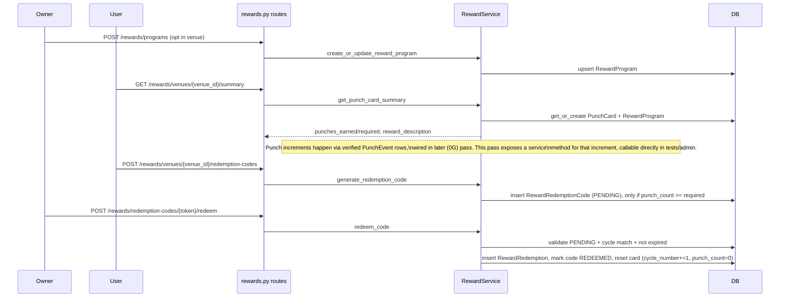

# Core Reward Service and API

## Relocation note (hackathon judging)

Between drafting this plan and implementing it, `backend/vendor/hour-rewards-sdk` and
`mobile/vendor/hour-rewards-ui` appeared as their own git submodules (separate repos), and
the host app's local `shared/models/{punch_card,punch_event,reward_program,reward_redemption,reward_redemption_code}.py`
were replaced by `pip install -e vendor/hour-rewards-sdk` + `from hour_rewards.models import ...`.

Given that, `RewardService` and its response DTOs below were implemented **inside the SDK**
(`hour_rewards/service.py`, `hour_rewards/models/responses.py`) rather than in
`backend/shared/services/`, so the rules ("the tables, their constraints, and the rules baked
into them", per the SDK's README) are visible in the standalone judged repo — mirroring how
`hour-rewards-ui` keeps `isReadyToRedeem` in the package and data-fetching in the host app.
`RewardService` takes plain UUIDs and an `AsyncSession` only; it never imports the host app.
Authorization (owner/admin checks) and FastAPI wiring stay in `backend/api_service/routes/rewards.py`
since those inherently depend on the host's auth system. See the SDK's README, "Service layer".

## Scope

This builds the service + route layer directly on top of the already-migrated schema (`reward_programs`, `punch_cards`, `punch_events`, `reward_redemption_codes`, `reward_redemptions` — see [backend/shared/models/](backend/shared/models/)). It implements exactly the redemption flow already documented in [.cursor/plans/venue_rewards_punch_card_system_5299d161.plan.md](.cursor/plans/venue_rewards_punch_card_system_5299d161.plan.md) (lines 113-117), minus step 1 (AI receipt verification creating `PunchEvent` rows — that stays a manual/test-only path for now since the 0G verification service isn't built yet).

Explicitly out of scope: receipt image upload/OCR/0G verification wiring, Hedera columns/calls, mobile client changes. Those are tracked separately.

## Flow being implemented

## New service — [backend/shared/services/reward_service.py](backend/shared/services/reward_service.py)

Static-async `RewardService`, matching [backend/shared/services/deal.py](backend/shared/services/deal.py):

- `get_reward_program_for_venue(session, venue_id) -> Optional[RewardProgram]`
- `create_or_update_reward_program(session, create_model: RewardProgramCreate) -> RewardProgram` — upsert by `venue_id` unique constraint (create if absent, else apply update fields); used for the opt-in flow
- `update_reward_program(session, venue_id, update_model: RewardProgramUpdateRequest) -> RewardProgram` — 404s via `ValueError` if no program exists yet
- `get_or_create_punch_card(session, user_id, venue_id) -> PunchCard` — lazy creation per the model's own docstring
- `get_punch_card_summary(session, user_id, venue_id) -> Optional[PunchCardSummaryResponse]` — returns `None` when venue has no enabled `RewardProgram` (mirrors `PunchCardSummary | null` shape already expected by [mobile/src/utils/rewardsMock.ts](mobile/src/utils/rewardsMock.ts)); otherwise get-or-creates the card and returns `punches_earned=card.punch_count`, `punches_required=program.punches_required`, `reward_description=program.reward_description`
- `get_punch_history(session, user_id, venue_id) -> List[RewardHistoryEventResponse]` — merges verified `PunchEvent` rows (`type="punch"`, `occurred_at=created_at`) and `RewardRedemption` rows (`type="redeem"`) for that user+venue, sorted by time descending
- `record_verified_punch(session, punch_card_id) -> PunchCard` — increments `punch_count` by 1; the seam future receipt-verification work calls after marking a `PunchEvent` `VERIFIED` (not wired to any route in this pass, but unblocks writing a test/manual-trigger path for the redemption flow below)
- `generate_redemption_code(session, user_id, venue_id) -> RewardRedemptionCode` — raises if `punch_count < punches_required`; else `secrets.token_urlsafe(32)` token, `cycle_number=card.cycle_number`, status `PENDING`
- `redeem_code(session, token, owner_id) -> RewardRedemption` — loads code by token, validates `status == PENDING`, not expired, `code.cycle_number == card.cycle_number`; on success creates `RewardRedemption` (snapshotting `punches_required`/`reward_description` off the program), sets code `status=REDEEMED`, `redeemed_at`, `redeemed_by_owner_id`, resets card (`cycle_number += 1`, `punch_count = 0`)

Response/request pydantic models colocated in the models files where they already partially exist (`RewardProgramResponse` etc. in [backend/shared/models/reward_program.py](backend/shared/models/reward_program.py)) — add `PunchCardSummaryResponse` and `RewardHistoryEventResponse` there or in `punch_card.py`, matching the field names mobile already expects (`punches_earned`, `punches_required`, `reward_description`, `occurred_at`, `type`).

## New routes — [backend/api_service/routes/rewards.py](backend/api_service/routes/rewards.py)

New `APIRouter(prefix="/rewards", tags=["rewards"])`, registered in [backend/api_service/main.py](backend/api_service/main.py) alongside the other `api_router.include_router(...)` calls:

- `POST /rewards/programs` — body `RewardProgramCreate`, gated by `VenueOwnerOrAdmin` (dependency takes `venue_id` from the body's `venue_id` field via a small wrapper, matching how [backend/api_service/routes/owner.py](backend/api_service/routes/owner.py) uses it path-param-based — confirm whether `VenueOwnerOrAdmin`'s `venue_id` dependency can bind from a body field or if this needs a path-based `POST /rewards/venues/{venue_id}/program` instead, to stay consistent with existing owner-route shapes)
- `PATCH /rewards/venues/{venue_id}/program` — `VenueOwnerOrAdmin` gated, body `RewardProgramUpdateRequest`
- `GET /rewards/venues/{venue_id}/program` — public or `CurrentUserOptional`, returns `RewardProgramResponse` or 404
- `GET /rewards/venues/{venue_id}/summary` — `CurrentUser` gated, returns `PunchCardSummaryResponse` or `204`/`null` body when no program
- `GET /rewards/venues/{venue_id}/history` — `CurrentUser` gated, returns `List[RewardHistoryEventResponse]`
- `POST /rewards/venues/{venue_id}/redemption-codes` — `CurrentUser` gated, returns the generated code/token (for QR rendering)
- `POST /rewards/redemption-codes/{token}/redeem` — owner-facing; since the code doesn't carry `venue_id` in the URL, look up the code first inside the service, then check the resolved venue against `VenueOwnerOrAdmin` semantics manually (can't use the existing path-param-based dependency directly) — do the owner/admin check inline using `Owner` lookup against the resolved `venue_id`, following the same logic `require_venue_owner_or_admin` in [backend/shared/utils/auth.py](backend/shared/utils/auth.py) encapsulates

All routes follow the try/except -> `HTTPException(500, ...)` + `logger.error` pattern used throughout [backend/api_service/routes/deal.py](backend/api_service/routes/deal.py).

## Out of scope (unchanged from referenced plans)

- Receipt image upload endpoint, OCR/0G verification, and wiring `record_verified_punch` into any route.
- Hedera columns/config/service calls.
- Mobile: `rewardsMock.ts` swap is a natural immediate follow-up once this merges, but not included here.
- Admin dashboard UI for configuring programs.

## Testing

Add `backend/tests/test_reward_service.py` covering: opt-in creates program, `get_or_create_punch_card` is idempotent, summary is `None` without a program, `generate_redemption_code` rejects under-threshold cards, full redeem flow resets cycle/punch_count and writes a `RewardRedemption`, redeem rejects wrong-cycle/expired/already-redeemed codes — using the existing `test_db` fixture from [backend/tests/conftest.py](backend/tests/conftest.py) (no new fixtures needed, all models are already imported there).
