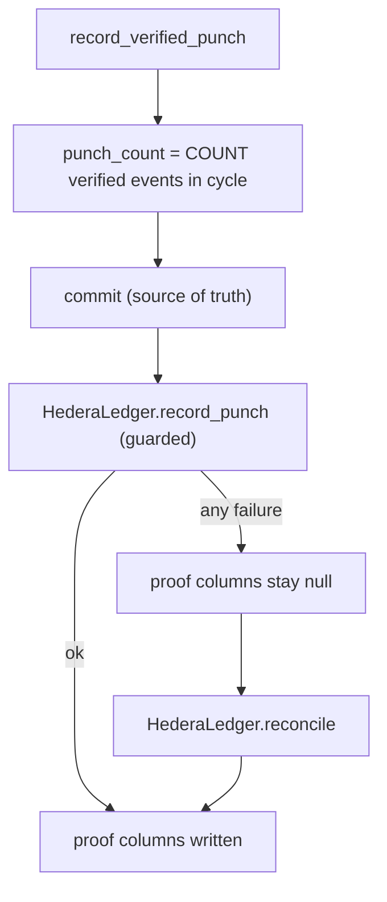

## What's actually broken

Ranked by how likely a judge or a retrying client hits it:

1. **A punch can be applied twice.** `record_verified_punch` blind-increments (`card.punch_count += 1` in [hour_rewards/service.py](backend/vendor/hour-rewards-sdk/hour_rewards/service.py)), so a client retry after a slow-but-successful request inflates the count.
2. **A missed HCS message is never republished.** `_publish` logs and moves on ([hour_rewards/hedera/ledger.py](backend/vendor/hour-rewards-sdk/hour_rewards/hedera/ledger.py)); no later call looks at earlier `PunchEvent` rows with a null `hedera_topic_sequence_number`. The ledger's own docstring claim that "the next call picks it up" is only true for mint and program setup.
3. **Mint-then-fail duplicates NFTs.** `ensure_card_nft` mints, transfers, *then* persists the serial. A transfer failure or a commit failure discards a real on-chain serial, and the next punch mints a second one.
4. **Not everything is caught.** Only the `transactions.*` calls sit in `try`. Fernet errors, `MetadataTooLargeError`, and the proof-row `session.commit()` in `_publish` can escape into the request after the punch already committed - a 500 that invites the retry from (1).



## What I'd fix

### 1. Make the punch count derived, not incremented
In [hour_rewards/service.py](backend/vendor/hour-rewards-sdk/hour_rewards/service.py), replace the increment with a count of this cycle's verified events - which is what `PunchCard`'s docstring already says the column is:

```python
card.punch_count = await RewardService._verified_punch_count(session, card)
```

```python
@staticmethod
async def _verified_punch_count(session: AsyncSession, card: PunchCard) -> int:
    result = await session.execute(
        select(func.count())
        .select_from(PunchEvent)
        .where(
            PunchEvent.punch_card_id == card.id,
            PunchEvent.cycle_number == card.cycle_number,
            PunchEvent.status == PunchEventStatus.VERIFIED,
        )
    )
    return int(result.scalar_one())
```

Idempotent for free, no new column, no migration, and it self-heals a card whose counter drifted. Cost: three call sites in [backend/tests/test_reward_service.py](backend/tests/test_reward_service.py) (lines 202, 221, 243) call `record_verified_punch` with no event row and must switch to the existing `_make_verified_punch` helper.

### 2. Persist every Hedera id the moment it exists
In [hour_rewards/hedera/ledger.py](backend/vendor/hour-rewards-sdk/hour_rewards/hedera/ledger.py):

- `ensure_program_ledger`: commit the token id before attempting the topic, so a topic failure can't orphan a created collection.
- `ensure_card_nft`: commit `hedera_nft_serial` immediately after `mint_card`, then attempt `transfer_card` in its own `try`. A failed transfer leaves a real, findable serial instead of a lost one.
- Add `hedera_nft_account_id: Optional[str]` to [models/punch_card.py](backend/vendor/hour-rewards-sdk/hour_rewards/models/punch_card.py), set after a successful transfer. This is the one new column, and it is what makes "minted but not handed over" a queryable state rather than an invisible one. Add it to the column list in `upgrade_hedera` in [hour_rewards/migrations.py](backend/vendor/hour-rewards-sdk/hour_rewards/migrations.py) - the op is already guarded by `_existing_columns`, and revision `z3a4b5c6d7e8` only exists on your local dev DB, so `alembic downgrade -1 && alembic upgrade head` picks it up.

### 3. Nothing escapes the mirror
Wrap the three public entry points (`ensure_program_ledger`, `record_punch`, `record_redemption`) so the internals become private `_`-prefixed methods and any unexpected exception is logged and followed by a `session.rollback()`, returning the caller's row untouched. Safe because `RewardService` always commits before calling the mirror, so a rollback here can never discard the punch.

### 4. One reconcile pass, driven by the null columns
Add `HederaLedger.reconcile(session, limit=50) -> Dict[str, int]` to [hour_rewards/hedera/ledger.py](backend/vendor/hour-rewards-sdk/hour_rewards/hedera/ledger.py), doing in order:

- enabled programs missing a token or topic - call `ensure_program_ledger`
- cards with `punch_count > 0` and no serial - call `ensure_card_nft`
- cards with a serial and no `hedera_nft_account_id` - retry `transfer_card` only
- verified `PunchEvent` rows with a null `hedera_topic_sequence_number` (oldest first) - publish the punch message with `at` set to the event's `created_at`, `count` set to the number of verified events in that cycle up to it, and `"backfill": true` so a reader can tell it landed late; write the returned proofs back
- `RewardRedemption` rows with a null sequence number - same treatment
- once per touched card, a single `update_card_metadata` to the card's *current* cycle and count (metadata is a current-state projection; historical URIs need no replay)

Returns a counts dict so the runner can print what it did.

### 5. A runner, not a scheduler
Add `backend/scripts/hedera_reconcile.py` (~20 lines): reuse the engine/session bootstrap from [backend/scripts/init_local_db.py](backend/scripts/init_local_db.py) and the existing `configure_rewards_ledger()` from [backend/api_service/main.py](backend/api_service/main.py), call `reconcile`, print the counts. Run it before the demo, or after any testnet wobble. If it later wants to be automatic, it is one call from a periodic job - but that is not worth building now.

## What I'd deliberately skip

- **An outbox/queue table.** Every pending item is already derivable from a null column; a second write path is more failure surface, not less.
- **Cron, Celery, or startup hooks.** A manual script is the right robustness-per-line for a hackathon.
- **Mirror-node REST polling** to confirm ownership or fetch consensus timestamps.
- **Exactly-once HCS.** An ambiguous timeout can duplicate a message; every message already carries the `event`/`redemption` UUID, so a consumer dedupes on that. Worth one sentence in the module docstring, not code.
- **In-request retries with backoff.** The request path stays one attempt; reconcile is the retry.
- **New admin endpoints.** Keeps host glue at the script.

## Tests

Add to [backend/tests/test_reward_hedera.py](backend/tests/test_reward_hedera.py), using the existing `ledger` fake-transactions fixture:

- calling `record_verified_punch` twice for the same event leaves `punch_count == 1`
- mint succeeds and transfer raises: serial is persisted, `hedera_nft_account_id` is null, and `reconcile` completes the transfer without minting a second serial
- full outage across a punch, then `reconcile`: program ids, mint, and the backfilled punch message all land, and the event row ends up with a sequence number
- an unexpected failure inside the mirror (monkeypatch `card_metadata_uri` to raise) does not propagate out of `record_verified_punch`

Then re-run the SDK tests, the two host reward test files, black/isort/flake8/mypy on the SDK, and the migration round trip.