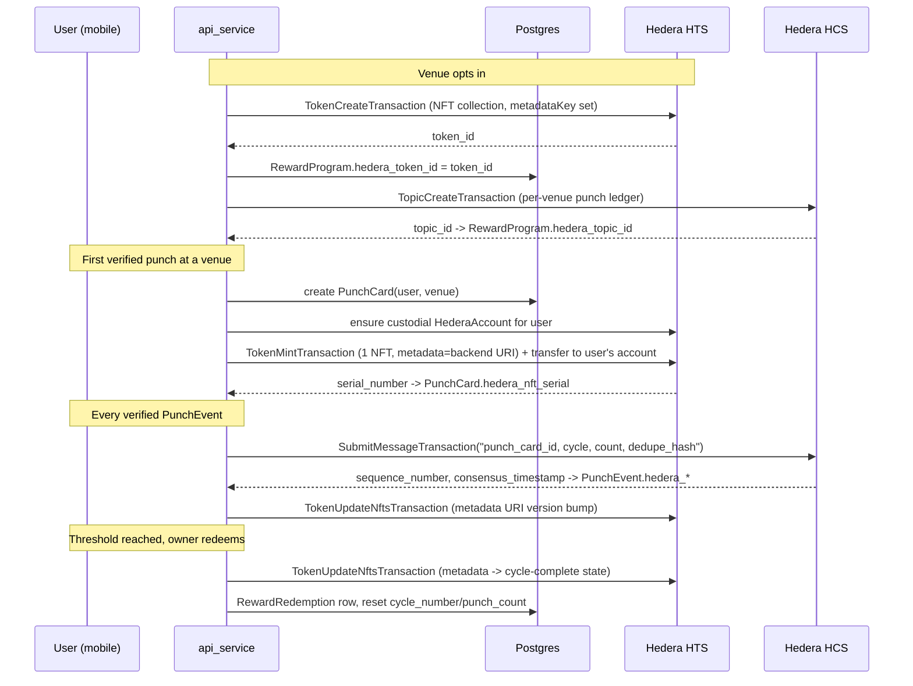

# Hedera HTS/HCS Punch Card NFT Integration

## Bounty target
Targets [ETHGlobal Lisbon 2026 — Hedera: "No Solidity Allowed" — Build with Hedera SDKs](https://ethglobal.com/events/lisbon2026/prizes/hedera) ($3,000, up to 3x$1,000): SDK-only (no smart contracts), combining >=2 native services. We combine **HTS** (the punch-card NFT) with **HCS** (tamper-proof punch ledger) using the Python SDK directly from `api_service`, satisfying the "coherent end-to-end UX" and "audit trails via HCS" optional-enhancement criteria.

## Base schema (not yet implemented — required first)
None of the tables from the referenced plan (`/Users/matthew/.cursor/plans/venue_rewards_punch_card_system_5299d161.plan.md`) exist in the codebase yet, so this plan builds them plus the Hedera columns together in one migration:
- [backend/shared/models/reward_program.py](backend/shared/models/reward_program.py) — per-venue opt-in config
- [backend/shared/models/punch_card.py](backend/shared/models/punch_card.py) — one active card per (user, venue)
- [backend/shared/models/punch_event.py](backend/shared/models/punch_event.py) — append-only AI-verified receipt scan log
- [backend/shared/models/reward_redemption_code.py](backend/shared/models/reward_redemption_code.py) — QR tokens
- [backend/shared/models/reward_redemption.py](backend/shared/models/reward_redemption.py) — permanent redemption history

Field-level detail (unique constraints, enums, relationships) follows exactly what's already specified in that plan file — not repeated here, only the Hedera-specific additions are new.

**Alembic note:** `alembic/versions/` currently has 3 heads (`x1y2z3a4b5c6`, `n0o1p2q3r4s5`, `m3n4o5p6q7r8` — confirmed via graph walk). Must resolve/merge before writing `down_revision` on the new migration, don't assume linear history.

## Entity/flow overview



## Token/collection strategy
- One HTS NFT collection (`TokenCreateTransaction`, `TokenType.NonFungibleUnique`) per venue, created when `RewardProgram` is created. `supplyKey` + `metadataKey` (HIP-657) held centrally by the app's operator account — required at creation time since a metadata key cannot be added later.
- One NFT serial minted per `PunchCard` (per user+venue), lazily on first verified punch — matches "each user gets an NFT per venue that opts in" exactly. Not re-minted per cycle; cycle resets update the existing NFT's metadata instead (cheaper, matches the existing `cycle_number`-increments-in-place design).

## NFT metadata — backend API instead of IPFS
Per your call: skip IPFS pinning. The on-chain `metadata` field (capped at 100 bytes both at mint and at every `TokenUpdateNftsTransaction`, so it must be a pointer, not the full JSON) is a URI into our own API:
```
https://api.get-hour.com/v1/rewards/nft-meta/{punch_card_id}
```
New public (unauthenticated, no PII) route, e.g. [backend/api_service/routes/rewards.py](backend/api_service/routes/rewards.py), returns live HIP-412 JSON built from `PunchCard`/`RewardProgram` at request time:
```json
{
  "name": "Joe's Bar — Punch Card",
  "creator": "Hour",
  "image": "<venue image url>",
  "type": "image/png",
  "format": "HIP412@2.0.0",
  "properties": {
    "venue_id": "...",
    "cycle_number": 2,
    "punch_count": 3,
    "punches_required": 5,
    "reward_description": "Free appetizer",
    "status": "in_progress"
  }
}
```
Because the endpoint is always live, wallets/Hashscan re-fetch current state on demand — but we still fire `TokenUpdateNftsTransaction` on every verified punch and every redemption (with a `?v=N` cache-buster in the URI) so each state change is itself a timestamped, on-chain-verifiable transaction, not just a mutable pointer. Cost is ~$0.001/update.

## Custody model — custodial (per your call)
Users authenticate via Google/Apple, no existing wallet concept. New table [backend/shared/models/hedera_account.py](backend/shared/models/hedera_account.py) (`HederaAccount`):
- `user_id: UUID` FK `users.id`, `ondelete="CASCADE"`, unique
- `hedera_account_id: str`
- `encrypted_private_key: str` — Fernet-encrypted at rest using a new `HEDERA_KEY_ENCRYPTION_SECRET` config value
- `network: str` default `"testnet"`
- `created_at`/`updated_at` via `TimestampSQLModel`

Created lazily (`AccountCreateTransaction`, `setMaxAutomaticTokenAssociations` high) the first time a user needs an NFT. Treasury mints to itself then transfers to the user's account in a second call (HTS always mints to treasury first). Called out explicitly as a known hackathon simplification (custodial keys, not user-owned wallets) — real wallet connect (HashPack, etc.) is a roadmap item, out of scope here.

## New/extended tables (deltas only — base fields per referenced plan)
- `RewardProgram`: + `hedera_token_id: Optional[str]`, `hedera_topic_id: Optional[str]`
- `PunchCard`: + `hedera_nft_serial: Optional[int]`
- `PunchEvent`: + `hedera_hcs_sequence_number: Optional[int]`, `hedera_hcs_consensus_timestamp: Optional[str]`, `hedera_metadata_update_tx_id: Optional[str]`
- `RewardRedemption`: + `hedera_metadata_update_tx_id: Optional[str]`
- New `HederaAccount` table (above)

## New service layer
[backend/shared/services/hedera_service.py](backend/shared/services/hedera_service.py) — static-async `HederaService(session, ...)` pattern matching [backend/shared/services/deal.py](backend/shared/services/deal.py)/[backend/shared/services/venue.py](backend/shared/services/venue.py). Functions:
- `create_venue_token(reward_program)` — `TokenCreateTransaction`, stores `hedera_token_id`
- `create_venue_topic(reward_program)` — `TopicCreateTransaction`, stores `hedera_topic_id`
- `ensure_user_hedera_account(user)` — lazy custodial account creation, encrypts+stores key in `HederaAccount`
- `mint_punch_card_nft(punch_card)` — mint + transfer to user's custodial account, stores `hedera_nft_serial`
- `submit_punch_hcs_message(punch_event)` — `SubmitMessageTransaction` to the venue's topic, stores sequence/timestamp back on `PunchEvent`
- `update_nft_metadata(punch_card)` — `TokenUpdateNftsTransaction` with the versioned backend metadata URI

Uses `hiero-sdk-python` (PyPI, community/Hiero-maintained, confirmed supports `TokenUpdateNftsTransaction`/HIP-657) — add to [backend/requirements.txt](backend/requirements.txt). **Risk flag:** package is pre-alpha (v0.2.7) — if a needed transaction type is missing/broken mid-build, fallback is a small Node sidecar using `@hashgraph/sdk` (JS SDK is the most battle-tested) invoked over HTTP from `api_service`.

## Config additions
[backend/shared/config.py](backend/shared/config.py) `Settings` — new `Optional[str] = None` fields following existing pattern: `HEDERA_NETWORK` (default `"testnet"`), `HEDERA_OPERATOR_ACCOUNT_ID`, `HEDERA_OPERATOR_PRIVATE_KEY`, `HEDERA_METADATA_KEY`, `HEDERA_KEY_ENCRYPTION_SECRET`.

## Migration
One hand-written migration creating the 5 base tables (dependency order per referenced plan) + `hedera_account` table + the Hedera columns above, following the `op.create_table` style in [backend/alembic/versions/f3a1c9d2e4b7_add_cities_table.py](backend/alembic/versions/f3a1c9d2e4b7_add_cities_table.py). Register all new models in [backend/alembic/env.py](backend/alembic/env.py)'s import block.

## Practical build notes / gotchas
- Mirror Node (Hashscan/wallets) lags consensus by a few seconds — demo flow should read the receipt/record from the direct SDK call for immediate UI feedback, only use Mirror Node for the "verify on Hashscan" reveal.
- Testnet HBAR is free via faucet; per-transaction costs are fractions of a cent — no real budget risk during the hackathon.
- 100-byte cap applies to the on-chain metadata field on both mint and every `TokenUpdateNftsTransaction` — never put raw JSON on-chain, always a URI.

## Out of scope for this pass (matches referenced plan's own scoping)
- Full `RewardService` (receipt submission, AI verification pipeline, redemption code generation/redeem) — the Hedera calls above are written as functions ready to be invoked from those call sites once built, not wired into a full service yet.
- Mobile/dashboard UI (QR display/scan, "my punch cards", wallet/NFT viewing).
- Non-custodial wallet connect (HashPack).
- Optional "redeemed badge NFT" collectible enhancement — flagged as a nice-to-have, not built in this pass.
</plan>
<parameter name="todos">[{"id":"resolve-alembic-heads","content":"Resolve the 3 existing alembic heads before writing the new migration's down_revision"},{"id":"base-models","content":"Create the 5 base punch-card models (reward_program, punch_card, punch_event, reward_redemption_code, reward_redemption) per the referenced plan"},{"id":"hedera-account-model","content":"Create HederaAccount model (custodial keys, Fernet-encrypted) in backend/shared/models/hedera_account.py"},{"id":"hedera-columns","content":"Add Hedera reference columns to RewardProgram, PunchCard, PunchEvent, RewardRedemption"},{"id":"relationships","content":"Wire reward_program/punch_cards relationships on Venue and User models"},{"id":"migration","content":"Write single migration creating all tables + Hedera columns, register models in alembic/env.py"},{"id":"config","content":"Add HEDERA_* settings to backend/shared/config.py"},{"id":"hedera-service","content":"Add hiero-sdk-python dependency and implement backend/shared/services/hedera_service.py (create_venue_token, create_venue_topic, ensure_user_hedera_account, mint_punch_card_nft, submit_punch_hcs_message, update_nft_metadata)"},{"id":"metadata-route","content":"Add public NFT metadata endpoint in backend/api_service/routes/rewards.py returning HIP-412 JSON from PunchCard/RewardProgram state"}]