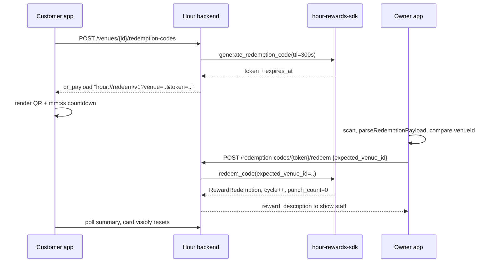

# Punch Card QR Redemption

## No QR service needed

QR encoding is a pure offline transform, so nothing needs signing up for. `react-native-qrcode-svg` renders locally on top of `react-native-svg` 15.12.1 (already installed). A hosted generator (api.qrserver.com, QR Monkey, Google Charts) would mean sending a live redemption token to a third party and needing network at display time, which is strictly worse for both security and the demo.

## What already exists

- `RewardService.generate_redemption_code` / `redeem_code` in [backend/vendor/hour-rewards-sdk/hour_rewards/service.py](backend/vendor/hour-rewards-sdk/hour_rewards/service.py) with `pending`/cycle/expiry guards, plus Hedera mirroring on redeem.
- Routes `POST /api/rewards/venues/{venue_id}/redemption-codes` and `POST /api/rewards/redemption-codes/{token}/redeem` in [backend/api_service/routes/rewards.py](backend/api_service/routes/rewards.py).
- Owner scanner UI: `QrRedemptionScanModal`, `QrScannerView`, `QrRedemptionResultView` in [mobile/vendor/hour-rewards-ui/src](mobile/vendor/hour-rewards-ui/src).
- `reward_redemption_codes.expires_at` column already migrated, so **no new Alembic migration is needed**.

## What is missing

- No customer QR display, no `rewardsApi` (the screen reads [mobile/src/utils/rewardsMock.ts](mobile/src/utils/rewardsMock.ts)), `verifyRedemptionQr` returns `{ approved: true }` after a 1s sleep, `expires_at` is never set, and the QR would carry a bare token with no venue in it.

## Flow



## 1. Python SDK (public submodule) — payload, TTL, venue check

New [hour_rewards/redemption_payload.py](backend/vendor/hour-rewards-sdk/hour_rewards/redemption_payload.py):

```python
REDEMPTION_PAYLOAD_VERSION = 1
# hour://redeem/v1?venue=<uuid>&card=<uuid>&cycle=<n>&token=<token>
def build_redemption_payload(*, venue_id, punch_card_id, cycle_number, token) -> str
def parse_redemption_payload(raw: str) -> RedemptionPayload  # pydantic model
class RedemptionPayloadError(ValueError)
```

`parse_redemption_payload` accepts a bare token as a legacy fallback (`venue_id=None`) so older codes still redeem, and rejects unknown versions/schemes with a specific message.

In `service.py`:
- Add `DEFAULT_REDEMPTION_TTL_SECONDS = 300` and `generate_redemption_code(..., ttl_seconds=DEFAULT_REDEMPTION_TTL_SECONDS)` setting `expires_at`.
- Reuse an existing unexpired `PENDING` code for the same cycle rather than minting one per tap; mark superseded ones `EXPIRED`.
- `redeem_code(..., expected_venue_id: Optional[UUID] = None)` raises `RewardServiceError("Redemption code is for a different venue")` on mismatch — defence in depth independent of the host's auth check.

In `models/responses.py`, extend `RewardRedemptionCodeResponse` with `venue_id`, `qr_payload`, `expires_in_seconds`; extend `RewardRedemptionResponse` with nothing (it already carries `reward_description`). Export the new symbols from `hour_rewards/__init__.py`, document the format in the SDK README, and add `tests/test_redemption_payload.py` (build/parse round-trip, wrong venue, malformed, legacy token) in the existing no-DB style of `tests/test_zg.py`.

## 2. Backend host — thin wiring only

[backend/api_service/routes/rewards.py](backend/api_service/routes/rewards.py):
- `_code_to_response(code, venue_id)` now fills `qr_payload` via `build_redemption_payload`.
- `POST /redemption-codes/{token}/redeem` gains an optional body `RedemptionRedeemRequest { expected_venue_id: UUID | None }`, passed through to `redeem_code`. Optional body keeps it backwards compatible.
- Map `RedemptionPayloadError` to 400.
- Extend [backend/tests/test_reward_service.py](backend/tests/test_reward_service.py) with TTL expiry and wrong-venue redemption cases.

## 3. TS SDK (public submodule) — QR display + scan parsing

- `src/redemptionPayload.ts`: TS mirror of the Python module (`buildRedemptionPayload`, `parseRedemptionPayload`, `REDEMPTION_PAYLOAD_VERSION`). Same grammar on both sides is the auditable bit.
- `src/useCountdown.ts`: `expiresAt` to `{ secondsLeft, isExpired, label }`, ticking once a second.
- `src/RewardQrCodeSheet.tsx`: full-screen `Modal` matching `PunchCameraModal`'s pattern, with a `loading | ready | expired | error` stage machine, `<QRCode value={qrPayload} />`, reward description, `mm:ss` countdown, and an `onRefresh` prop for expiry.
- `src/QrRedemptionScanModal.tsx`: new `expectedVenueId` prop; parse the scan first and short-circuit to a rejected result ("This code is for a different venue.") before any network call; hand the extracted `token` to `verifyRedemptionQr`.
- `src/QrRedemptionResultView.tsx`: name the reward on approval.
- `src/types.ts`: add `RedemptionCode`; widen the approved variant of `QrRedemptionVerificationResult` to carry `rewardDescription`.
- `package.json`: add `react-native-qrcode-svg` to `peerDependencies` + `devDependencies`; export the new symbols from `src/index.ts`.

The "Show QR code" button itself stays in the app screen, reusing the existing `styles.cta` pill so it matches the receipt CTA. The SDK owns the sheet, the countdown and the payload grammar.

## 4. Mobile app — real data

- Add `react-native-qrcode-svg` to [mobile/package.json](mobile/package.json).
- New `rewardsApi` in [mobile/src/utils/api.ts](mobile/src/utils/api.ts) following the `ownersApi` pattern: `getSummary`, `getHistory`, `createRedemptionCode`, `redeemCode(token, expectedVenueId)`, plus snake_case to camelCase mappers. Delete `rewardsMock.ts`.
- [mobile/app/venue/[id]/rewards.tsx](mobile/app/venue/[id]/rewards.tsx): fetch real summary/history; replace `handleRedeem` with `handleShowQrCode` (create code, open `RewardQrCodeSheet`); CTA label becomes "Show QR code"; poll the summary every ~5s while the sheet is open so the card visibly resets the moment the owner scans.
- [mobile/app/venue/[id]/index.tsx](mobile/app/venue/[id]/index.tsx): real `verifyRedemptionQr` calling `rewardsApi.redeemCode(token, venueId)` with 400/403/404/409 mapped to human messages; pass `expectedVenueId={venueId}`; source `RewardsPreviewCard` from the real summary.
- Regenerate `mobile/src/types/api.d.ts` with `npm run generate:api`.

## Out of scope

Receipt-photo upload has no host endpoint yet (`user_images` is write-only from the client's perspective), so `verifyPunchPhoto` stays stubbed and punches are still granted locally in the UI. Card completion for the demo comes from seeded data or a direct `punch_count` update.