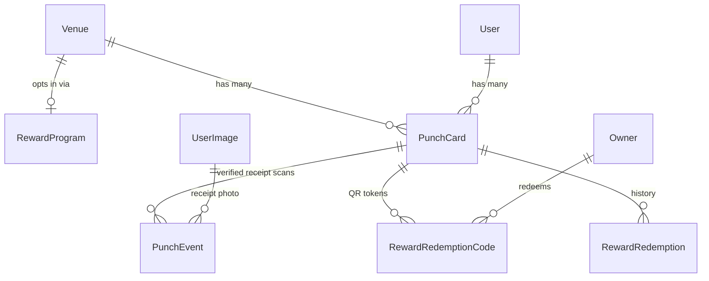

# Venue Rewards (Punch Card) Database Design

## Scope
This pass covers the **data layer only**: new SQLModel model files under `backend/shared/models/`, relationship wiring on existing `Venue`/`User` models, and a hand-written Alembic migration — following the exact conventions found in `backend/shared/models/user_favorite.py`, `backend/shared/models/deal.py`, `backend/shared/models/owner.py`, and `backend/alembic/versions/f3a1c9d2e4b7_add_cities_table.py`. Service layer (`RewardService`), API routes, QR image generation, and mobile/dashboard UI are **not** included here — they're natural follow-ups once the schema is settled (confirmed nothing already exists for punch/reward/QR on backend, mobile, or dashboard).

## Entity overview

## Tables

### 1. `reward_programs` — per-venue opt-in config (`backend/shared/models/reward_program.py`)
- `id: UUID` PK
- `venue_id: UUID` FK `venues.id`, `ondelete="CASCADE"`, **unique** (one program per venue = the "opt-in")
- `punches_required: int` — threshold, e.g. 5 or 10
- `reward_description: str` — what the user gets, e.g. "Free appetizer"
- `is_enabled: bool = True` — lets a venue pause rewards without losing config
- `created_at` / `updated_at` via `TimestampSQLModel`

Existence of a row = venue opted in; `is_enabled=False` = temporarily paused without deleting the config/history.

### 2. `punch_cards` — one active card per user per venue (`backend/shared/models/punch_card.py`)
- `id: UUID` PK
- `user_id: UUID` FK `users.id`, `ondelete="CASCADE"`
- `venue_id: UUID` FK `venues.id`, `ondelete="CASCADE"`
- `cycle_number: int = 1` — increments every time the card is redeemed/reset (so past punches stay attributable to a specific cycle instead of being deleted)
- `punch_count: int = 0` — denormalized count of **verified** punches in the current cycle, kept in sync by the service layer whenever a `PunchEvent` is marked `VERIFIED` (fast reads without a `COUNT` query; reconcilable from `punch_events` if ever needed)
- `UniqueConstraint("user_id", "venue_id", name="uq_user_venue_punch_card")` — matches the `user_favorites` pattern for "one per venue"
- `created_at` / `updated_at` via `TimestampSQLModel`

Lazily created on a user's first punch at a venue (service-layer concern, not schema).

### 3. `punch_events` — append-only log of AI-verified receipt scans (`backend/shared/models/punch_event.py`)
Punches are **not** granted manually by owners — a user photographs their receipt, an AI pipeline (out of scope here, but analogous to the existing `venue_scrape_job` extraction pipeline) extracts the purchase details, and a punch is only counted if that extraction is valid *and* the receipt hasn't been used before. The schema below exists to make that idempotent and auditable:
- `id: UUID` PK
- `punch_card_id: UUID` FK `punch_cards.id`, `ondelete="CASCADE"`
- `venue_id: UUID` FK `venues.id`, `ondelete="CASCADE"` — denormalized so the dedupe constraint below doesn't require a join through `punch_cards`
- `cycle_number: int` — snapshot of the card's `cycle_number` at scan time, so progress-within-cycle can be queried directly even after future resets
- `receipt_image_id: Optional[UUID]` FK `user_images.id`, `ondelete="SET NULL"` — the uploaded photo; reuses the existing `UserImage` table (already used for scraper source images)
- `receipt_date: Optional[datetime]` — purchase date/time the AI extracted from the receipt
- `receipt_total_amount: Optional[Decimal]` — extracted total, kept for context/fraud review
- `receipt_identifier: Optional[str]` — extracted receipt/transaction number when present (best dedupe signal when available)
- `dedupe_hash: str` — normalized hash of the extracted receipt fields (e.g. venue + date + total + identifier), computed by the AI pipeline
- `status: PunchEventStatus` enum (`PENDING_REVIEW`, `VERIFIED`, `REJECTED`), default `PENDING_REVIEW`, stored via `sa_type=Enum(..., native_enum=False)` — matches the `ScrapeJobStatus` pattern in `venue_scrape_job.py`. Only `VERIFIED` rows count toward `punch_card.punch_count`
- `rejection_reason: Optional[str]` — e.g. `"duplicate_receipt"`, `"illegible_date"`, `"not_this_venue"`
- `ai_confidence_score: Optional[Decimal]` / `ai_notes: Optional[str]` — mirrors the existing `ai_confidence_score`/`ai_notes` fields on `DealBase` (`backend/shared/models/deal.py:90-91`)
- `created_at` / `updated_at` via `TimestampSQLModel`
- `UniqueConstraint("venue_id", "dedupe_hash", name="uq_venue_receipt_dedupe")` — makes re-submitting the same receipt at the same venue impossible at the DB level (belt-and-suspenders alongside whatever the AI pipeline checks), regardless of which card/user it's submitted under

### 4. `reward_redemption_codes` — one row per generated QR token (`backend/shared/models/reward_redemption_code.py`)
- `id: UUID` PK
- `punch_card_id: UUID` FK `punch_cards.id`, `ondelete="CASCADE"`
- `cycle_number: int` — which cycle this code authorizes; scanning is only valid if it still matches the card's current `cycle_number` (prevents stale/reused QR codes after a reset)
- `token: str`, unique + indexed — opaque value encoded in the QR (e.g. `secrets.token_urlsafe(32)`)
- `status: RewardRedemptionCodeStatus` enum (`PENDING`, `REDEEMED`, `EXPIRED`, `INVALIDATED`), default `PENDING`, stored via `sa_type=Enum(..., native_enum=False)` — matches `ScrapeJobStatus` in `venue_scrape_job.py`
- `expires_at: Optional[datetime]` — optional expiry window
- `redeemed_at: Optional[datetime]`
- `redeemed_by_owner_id: Optional[UUID]` FK `owners.id`, `ondelete="SET NULL"`
- `created_at` / `updated_at` via `TimestampSQLModel`

Kept as its own table (rather than fields on `punch_cards`) so every generated/expired/invalidated code stays auditable, not just the latest one.

### 5. `reward_redemptions` — permanent history of completed cycles (`backend/shared/models/reward_redemption.py`)
- `id: UUID` PK
- `venue_id: UUID` FK `venues.id`, `ondelete="CASCADE"` — denormalized for durable venue-level reporting
- `user_id: Optional[UUID]` FK `users.id`, `ondelete="SET NULL"` — denormalized; nullable so stats survive user deletion
- `punch_card_id: Optional[UUID]` FK `punch_cards.id`, `ondelete="SET NULL"`
- `redemption_code_id: Optional[UUID]` FK `reward_redemption_codes.id`, `ondelete="SET NULL"`
- `cycle_number: int`
- `punches_required: int` — snapshot of the threshold at redemption time (survives future program changes)
- `reward_description: str` — snapshot of what was rewarded
- `redeemed_by_owner_id: Optional[UUID]` FK `owners.id`, `ondelete="SET NULL"`
- `created_at` via `TimestampSQLModel` doubles as `redeemed_at`

## Redemption flow (schema-level)
1. User uploads a receipt photo → AI pipeline extracts `receipt_date`/`receipt_total_amount`/`receipt_identifier`, computes `dedupe_hash`, and inserts a `PunchEvent(punch_card_id, venue_id, cycle_number=card.cycle_number, receipt_image_id, ...)`. If the hash already exists for that venue (`uq_venue_receipt_dedupe`) or extraction fails validation, the row is `REJECTED` instead of double-counting. On `status=VERIFIED`, increment `card.punch_count`.
2. When `card.punch_count >= reward_program.punches_required`, a `RewardRedemptionCode` is generated (`status=PENDING`) for that `cycle_number`; this is what renders as the QR in the app.
3. Owner scans the code → validate `status == PENDING`, not expired, and `code.cycle_number == card.cycle_number`. On success: mark code `REDEEMED`, insert a `RewardRedemption` row (snapshotting threshold + reward text), then reset the card: `card.cycle_number += 1`, `card.punch_count = 0`.
4. Old `PunchEvent` and `RewardRedemptionCode` rows are never deleted — they remain queryable by their frozen `cycle_number` for full history/analytics.

## Relationship wiring on existing models
- `backend/shared/models/venue.py` — add `reward_program: Optional["RewardProgram"] = Relationship(back_populates="venue")` and `punch_cards: List["PunchCard"] = Relationship(back_populates="venue")`, alongside existing `deals`/`scrape_jobs` relationships (`Venue` at `backend/shared/models/venue.py:174-191`).
- `backend/shared/models/user.py` — add `punch_cards: List["PunchCard"] = Relationship(back_populates="user")`.
- New models declare the inverse `Relationship(back_populates=...)` sides plus plain (no back-populate) relationships to `Owner` (only for `redeemed_by_owner_id` on `RewardRedemptionCode`/`RewardRedemption`) and to `UserImage` (for `receipt_image_id` on `PunchEvent`), matching `Owner`'s own `user`/`venue` relationships in `backend/shared/models/owner.py:40-41`.

## Migration
- One new hand-written migration (e.g. `backend/alembic/versions/<rev>_add_rewards_tables.py`) creating all 5 tables in dependency order (`reward_programs` → `punch_cards` → `punch_events`, `reward_redemption_codes` → `reward_redemptions`), following the `op.create_table` + `sa.UUID()`/`sa.TIMESTAMP()`/`sa.Boolean(server_default=...)` style used in `f3a1c9d2e4b7_add_cities_table.py`, with explicit `UniqueConstraint`/`ForeignKeyConstraint` names.
- **Note:** `backend/alembic/versions/` currently has multiple heads (`x1y2z3a4b5c6`, `n0o1p2q3r4s5`, `m3n4o5p6q7r8`). Before writing `down_revision`, run `alembic heads` to confirm the correct current tip (or merge heads first) rather than assuming linear history.
- Register each new model in `backend/alembic/env.py`'s import block (alongside the existing `City`, `Deal`, `Owner`, etc. imports) so future autogenerate diffs pick them up.

## Out of scope for this pass (flag for later)
- **AI receipt-scanning pipeline** that turns an uploaded photo into a `PunchEvent` — extraction (date/total/identifier), `dedupe_hash` computation, and verify/reject decisioning. Would likely follow the staged-pipeline pattern already used in `backend/shared/services/venue_scrape_job/` (see `pipeline.py` + `stages/`).
- `RewardService` (create/list programs, submit receipt scan, generate code, redeem code) — would follow the static-async `XxxService(session, ...)` pattern from `backend/shared/services/deal.py`.
- API routes: admin config CRUD (`backend/api_service/routes/admin/`), a user-facing "submit receipt" + "my punch cards" endpoint, and owner-facing redeem-code endpoint (`VenueOwnerOrAdmin`-gated, similar to `backend/api_service/routes/owner.py`).
- QR rendering (mobile, for users) and scanning (owner mobile flow, for redemption only) — no QR/camera libraries currently installed in `mobile/package.json`; would need e.g. `react-native-qrcode-svg` + `expo-camera`.
- Dashboard surfacing (e.g. a new "Rewards" tab next to `VenueDealsPanel`/`VenueOwnersPanel`) for admins to configure `punches_required`/`reward_description` per venue.
